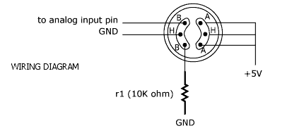

### Situacion de calibracion
- Temperatura 20°C.
- Humedad 65%.
- Concentracion de oxigeno 21%.
- Precalentamiento minimo necesario del sensor 10 horas.

### Conexiones del sensor MQ137


### Obtencion de MQ137_R0
- Generar el valor de R0 con el siguiente script
```
#include <Arduino.h>

// Corregir entrada analogica usada
#define MQ137_ANALOG_PIN A0 (valor por default)

MQ137 mq137(MQ137_ANALOG_PIN, true);

void setup() {
  Serial.begin(115200);
  mq137.begin();
}

void loop() {
  Serial.print("R0 -> ");
  Serial.println(mq137.getRo());
    
  delay(500);

}
```
- Una vez obtenido re-definir la constante MQ137_R0 `#define MQ137_R0 [valor]`

### Modo de uso
```
#include <Arduino.h>

#define MQ137_ANALOG_PIN A0

// Reemplazar por el valor arrojado al calibrar sensor
#define MQ137_R0 26.21f

#include <MQ137.h>

MQ137 mq137(MQ137_ANALOG_PIN, MQ137_R0, true);

void setup() {
  Serial.begin(115200);
  delay(5000);
  mq137.begin();
}

void loop() {
  Serial.print("PPM de amonio ->\t");
  Serial.println(mq137.getPPM());
  delay(1000);
}

```


### Link de consulta
- https://circuitdigest.com/microcontroller-projects/arduino-mq137-ammonia-sensor
- https://components101.com/sites/default/files/component_datasheet/MQ-137%20Sensor%20Datasheet.pdf
- https://components101.com/sensors/mq137-gas-sensor